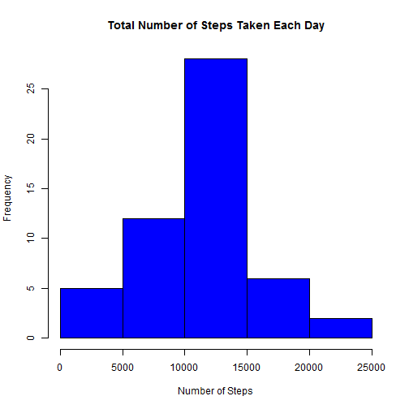
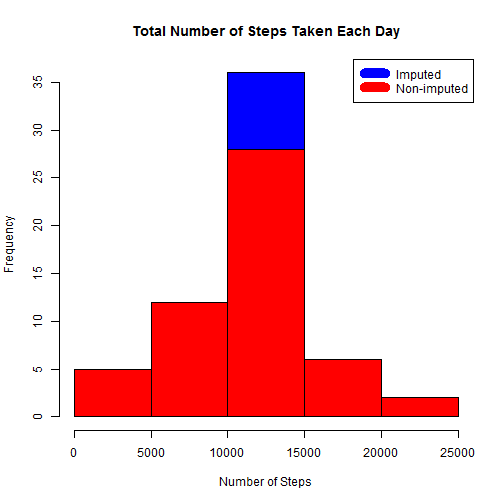
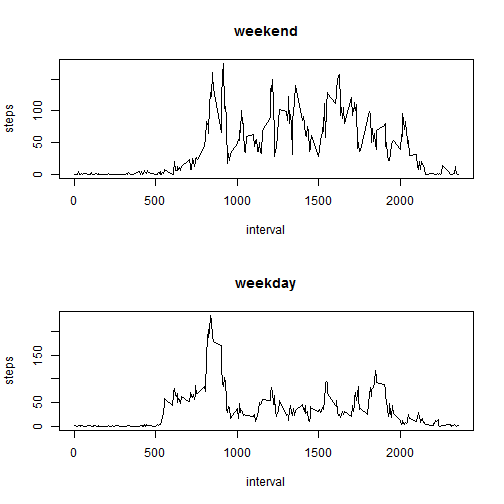

```r
knitr::opts_chunk$set(echo=TRUE)
setwd("D:/Coursera/Coursera - Reproducible Research/Week2")
```

## Loading and preprocessing the data

Load the data from website: https://d396qusza40orc.cloudfront.net/repdata%2Fdata%2Factivity.zip.


```r
zipFile <- "data/repdata-data-activity.zip"
if(!file.exists(zipFile)) {
        download.file("https://d396qusza40orc.cloudfront.net/repdata%2Fdata%2Factivity.zip", zipFile)
        unzip(zipFile, exdir = "data")
}

mydata <- read.csv("data/activity.csv", stringsAsFactors = FALSE)
str(mydata)
```

```
## 'data.frame':	17568 obs. of  3 variables:
##  $ steps   : int  NA NA NA NA NA NA NA NA NA NA ...
##  $ date    : chr  "2012-10-01" "2012-10-01" "2012-10-01" "2012-10-01" ...
##  $ interval: int  0 5 10 15 20 25 30 35 40 45 ...
```

Change the date variable from character to a date type.


```r
mydata$date <- as.Date(mydata$date, format = "%Y-%m-%d")
```


## What is mean total number of steps taken per day?

Histogram of the total number of steps taken each day.


```r
steps_by_day <- aggregate(steps ~ date, mydata, sum)
hist(steps_by_day$steps, main = paste("Total Number of Steps Taken Each Day"), 
     col="blue", xlab="Number of Steps")
```

 

Calculate and report the mean and median total number of steps taken per day.


```r
rmean <- mean(steps_by_day$steps)
print(paste("The mean is", rmean))
```

```
## [1] "The mean is 10766.1886792453"
```

```r
rmedian <- median(steps_by_day$steps)
print(paste("The median is", rmedian))
```

```
## [1] "The median is 10765"
```


## What is the average daily activity pattern?

1. The time series plot of the 5-minute interval (x-axis) and the average number of steps taken, averaged across all days (y-axis).


```r
steps_interval <- aggregate(steps ~ interval, data = mydata, mean)
plot(steps_interval, type = "l")
```

 

2. The 5-minute interval, on average across all the days in the dataset, contains the maximum number of steps, is:


```r
steps_interval$interval[which.max(steps_interval$steps)]
```

```
## [1] 835
```


## Imputing missing values

1. Calculate and report the total number of missing values in the dataset.


```r
sum(is.na(mydata))
```

```
## [1] 2304
```

2. Devise a strategy for filling in all of the missing values in the dataset. The strategy does not need to be sophisticated. For example, you could use the mean/median for that day, or the mean for that 5-minute interval, etc.

I will use the means for the 5-minute intervals for missing values.

3. Create a new dataset that is equal to the original dataset but with the missing data filled in.


```r
mydata_i <- merge(mydata, steps_interval, by = "interval", suffixes = c("", ".y"))
sel <- is.na(mydata_i$steps)
mydata_i$steps[sel] <- mydata_i$steps.y[sel]
mydata_i <- mydata_i[, c(1:3)]
```

4. The histogram of the total number of steps taken each day and Calculate and report the mean and median total number of steps taken per day. Do these values differ from the estimates from the first part of the assignment? What is the impact of imputing missing data on the estimates of the total daily number of steps?


```r
steps_by_day_i <- aggregate(steps ~ date, data = mydata_i, sum)
hist(steps_by_day_i$steps, main = paste("Total Number of Steps Taken Each Day"), 
     col="blue", xlab="Number of Steps")

#barplot(steps_date$steps, names.arg = steps_date$date, xlab = "date", ylab = "steps")

hist(steps_by_day$steps, main = paste("Total Number of Steps Taken Each Day"), 
     col="red", xlab="Number of Steps", add=T)
legend("topright", c("Imputed", "Non-imputed"), col=c("blue", "red"), lwd=10)
```

 

mean(steps_date$steps)

median(steps_date$steps)

The impact of the missing data seems to be not such important, esspecialy when estimating the total number of steps per day.


## Are there differences in activity patterns between weekdays and weekends?

1. The new factor variable in the dataset with two levels - weekday and weekend indicating whether a given date is a weekday or weekend day.


```r
sel <- weekdays(mydata$date) %in% c("Saturday", "Sunday")
mydata$daytype <- as.character("")
mydata[sel, ]$daytype <- "weekend"
mydata[!sel, ]$daytype <- "weekday"
mydata$daytype <- as.factor(mydata$daytype)
```

2. The panel plot containing a time series plot of the 5-minute interval (x-axis) and the average number of steps taken, averaged across all weekday days or weekend days (y-axis). 


```r
par(mfrow = c(2, 1))
for (type in c("weekend", "weekday")) {
    steps_type <- aggregate(steps ~ interval, data = mydata, 
                            subset = mydata$daytype == type, FUN = mean)
    plot(steps_type, type = "l", main = type)
}
```

 


